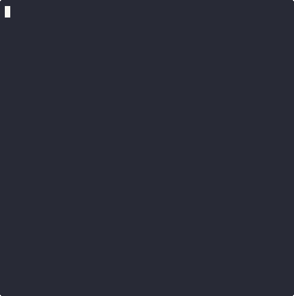

# *yafth* - Yet Another Fallout Terminal Hacking ~~Game~~
> Patrolling the Mojave almost makes you wish for a nuclear winter.

*yafth* is a C++ console application that replicates the terminal hacking experience from Fallout 3/4 and New Vegas.

## Demo

<p align="center">
  
</p>

## Installation
```
git clone https://github.com/gshigin/yet-another-fallout-terminal-hacking-game.git yafth
cd yafth
mkdir build && cd build
cmake ..
cmake --build .
```

## Usage
```
Usage: ./yafth [options]
Options:
  -h, --help              Show this help message
  -s, --science VALUE     Science level (0-100)
  -l, --lock VALUE        Lock level (0-4 or very_easy, easy, average, hard, very_hard)
  --seed VALUE            Optional seed for random generator
```